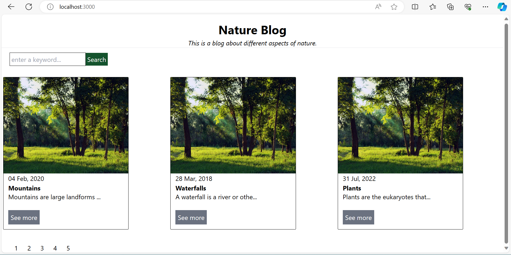

### Next.js

To run this app locally, ensure that next.js is installed in your pc.
Create the folder where you want the project to reside.

Navigate to the just created folder and run `npx create-next-app@latest`.
name the app "next-blog".
Note: The app doesn't use typescript and no src/ directory.

clone this repository.

run `cd next-blog` command.
Finally run `npm run dev` to start the development server.

Open [http://localhost:3000](http://localhost:3000) with your browser to see the result.

on successful implementation, this will be the landing page:

