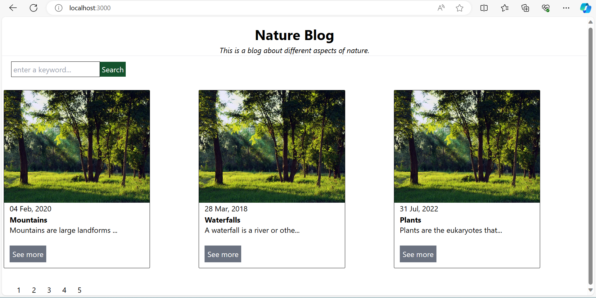

### Next.js

To run this app locally, ensure that next.js is installed in your pc.
Create the folder where you want the project to reside.

In command prompt, navigate to the just created folder and run this command `npx create-next-app@latest`.
name the app "next-blog".
Note: The app doesn't use typescript and no src/ directory.

Ensure that the local app/ directory has the same contents as this repository app/ directory(including sub-folders and files).

Now, run `cd next-blog` command.
Finally run `npm run dev` to start the development server.

Open [http://localhost:3000](http://localhost:3000) with your browser to see the result.

on successful implementation, this will be the landing page:

